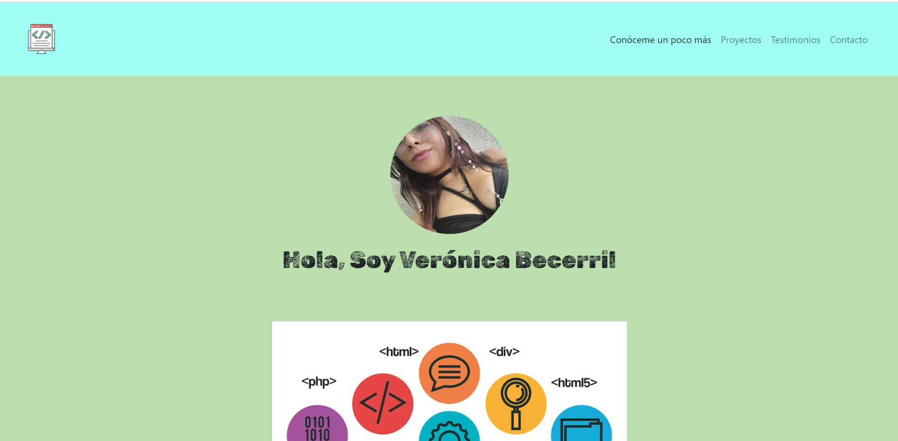
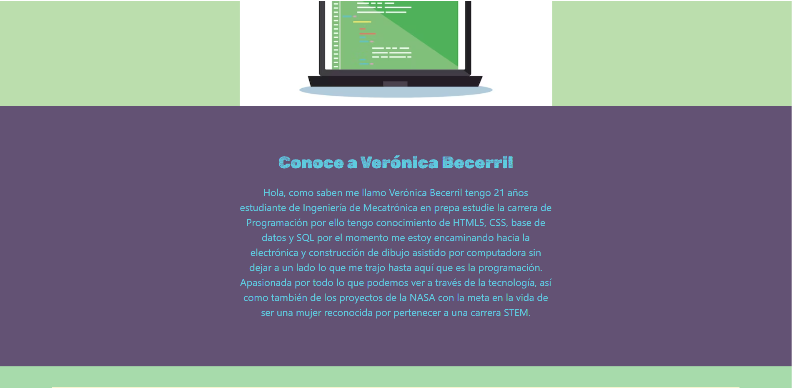
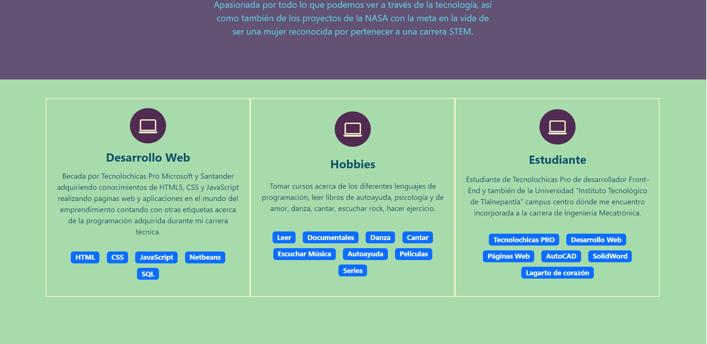
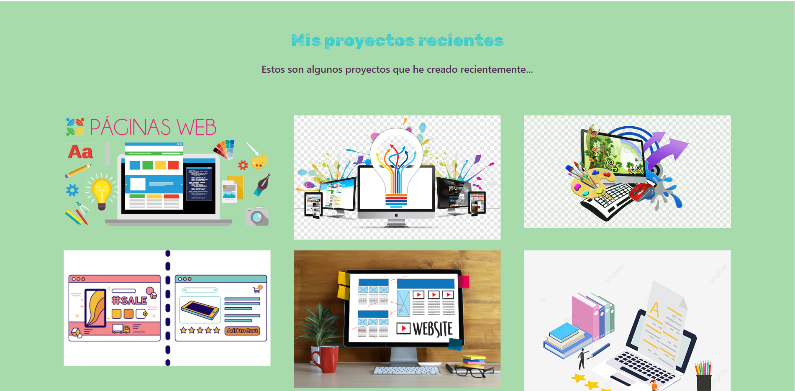
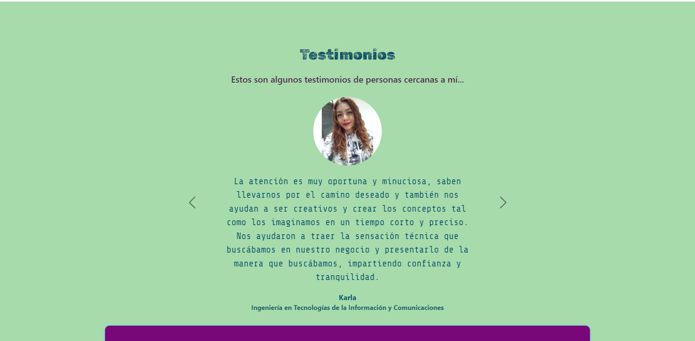

# Portafolio Adaptable (Responsive) con Bootstrap 5

Este proyecto creado para el bootcamp Tecnolochicas PRO, es una página web adaptable a dispositivos de distintos tamaños (este tipo de sitio web se conoce en inglés como "responsive"). 

El propósito de esta página web es mostrar el portafolio de proyectos de una desarrolladora y su experiencia. Incluye una descripción breve de su motivación, experiencia, conóceme más, proyectos, artículos publicados y formas de contacto. 

Contiene una carpeta de 'Imágenes' donde pueden localizar todo lo usado y las pictures usadas en cada parte del proyecto.

Proyecto realizado en HTML5, CSS y JavaScript, usado para complementar a cada uno de ellos y obtener nuestra página como lo pódran ver en las siguientes capturas de pantalla.

Nota de la Desarrolladora:

Como se visualizara en colores verde y azul y morado, es por el mar la naturaleza y por las mujeres que estamos atreviendonos a ser el futuro sector dentro de la tecnología.

### Capturas de pantalla:

Primera parte de la página web:

Experiencia:

Conóceme más:

Proyectos:

Testimonios:

Contacto:

## Tecnologías

Esta página web fue creada con:

* HTML
* CSS
* JavaScript 
* Bootstrap 5

Además, se incluyeron **Google Fonts** para personalizar la fuente y **Bootstrap icons** para incorporar íconos como flechas y logos de redes sociales populares, se intento dar la mayoria de las redes sociales para mejor contacto. 

## Español

El texto de la página web está escrito en español, al igual que las clases y atributos personalizados. Las clases relacionadas con Bootstrap se incluyeron en inglés.

